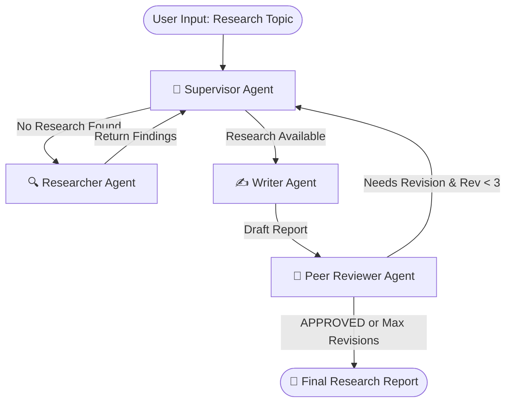

# Autonomous Multi-Agent AI Research Assistant 🤖🧠

[](https://www.python.org/downloads/)
[](https://github.com/langchain-ai/langgraph)
[](https://streamlit.io/)
[](https://www.together.ai/)
[](https://tavily.com/)
[](LICENSE)

An autonomous multi-agent research framework built with **LangGraph**, **LangChain**, **Together AI (Mixtral-8x7B)**, and **Tavily Search API**. 

The system orchestrates a team of specialized AI agents—Supervisor, Researcher, Writer, and Peer Reviewer (Critiquer)—to automatically research topics, compose structured Markdown reports, and iteratively refine them through peer feedback.

---

## 🌟 Key Features

- 🎯 **Supervisor Orchestration**: Uses conditional graph routing (`StateGraph`) to evaluate project state dynamically and route tasks to specialized agents.
- 🔍 **Autonomous Web Research**: Fetches live, real-time factual data from the web using Tavily's dedicated Search API.
- ✍️ **Iterative Draft Refinement**: Writes, critiques, and revises report drafts autonomously up to quality approval or recursion limits.
- 💻 **Real-Time Streamlit UI**: Interactive dashboard displaying step-by-step agent activity logs, progress indicators, metrics, and report downloads.
- ⚡ **CLI & Web Interface Support**: Flexible execution via command line (`main.py`) or web dashboard (`app.py`).

---

## 🏗 System Architecture



---

## 👥 Agent Team Roles

| Agent | Responsibility | Underlying Engine / Tool |
| :--- | :--- | :--- |
| **🎯 Supervisor** | State graph controller orchestrating routing & recursion decisions | Deterministic Rules + Mixtral-8x7B |
| **🔍 Researcher** | Fetches live web search results & synthesizes factual bullet points | Tavily Search API + Mixtral-8x7B |
| **✍️ Writer** | Synthesizes research into multi-section structured Markdown reports | Together AI (Mixtral-8x7B) |
| **🔎 Critiquer** | Evaluates drafts for completeness, structure, & depth; approves or requests edits | Mixtral-8x7B Peer Reviewer |

---

## 📁 Repository Structure

```
multi-agent-ai-research/
├── agents.py           # Core agent node implementations & prompt invocation
├── app.py              # Streamlit web application & real-time execution log
├── graph.py            # LangGraph StateGraph setup & node edge routing
├── main.py             # CLI entry point for command line execution
├── prompts.py          # Prompt engineering templates for all agents
├── requirements.txt    # Python dependencies
├── .env.example        # Environment variable template
├── .gitignore          # Git exclusion rules
├── LICENSE             # MIT License
└── README.md           # Project documentation
```

---

## 🚀 Quickstart Guide

### 1. Clone the Repository

```bash
git clone https://github.com/pdiyan85-dotcom/multi-agent-ai-research.git
cd multi-agent-ai-research
```

### 2. Create Virtual Environment & Install Dependencies

```bash
# Create virtual environment
python -m venv venv

# Activate virtual environment
# Windows (PowerShell):
.\venv\Scripts\Activate.ps1
# macOS/Linux:
source venv/bin/activate

# Install requirements
pip install -r requirements.txt
```

### 3. Set Up API Credentials

Copy `.env.example` to `.env` and fill in your API keys:

```bash
cp .env.example .env
```

Edit `.env`:
```env
TOGETHER_API_KEY=your_together_api_key_here
TAVILY_API_KEY=your_tavily_api_key_here
```

> **Get API Keys:**
> - [Together AI API Key](https://www.together.ai/)
> - [Tavily Search API Key](https://tavily.com/)

---

## 💻 Usage

### Launch Streamlit Dashboard

```bash
streamlit run app.py
```
Open your browser at `http://localhost:8501`. Enter any research topic and watch the agent team collaborate in real time!

### Launch via CLI

```bash
python main.py --topic "Impact of Quantum Computing on Cybersecurity" --iterations 15
```

---

## 📊 Sample Output & UI Features

- **Real-Time Node Logs**: Live activity status for each agent step.
- **Report Metrics**: Track word count, character count, revision cycles, and search batches.
- **Export Options**: Download final generated reports as `.md` or `.txt` files directly.

---

## 🤝 Contributing

Contributions are welcome! Feel free to open an issue or submit a pull request for improvements, bug fixes, or new features.

---

## 📜 License

Distributed under the MIT License. See [`LICENSE`](LICENSE) for details.
